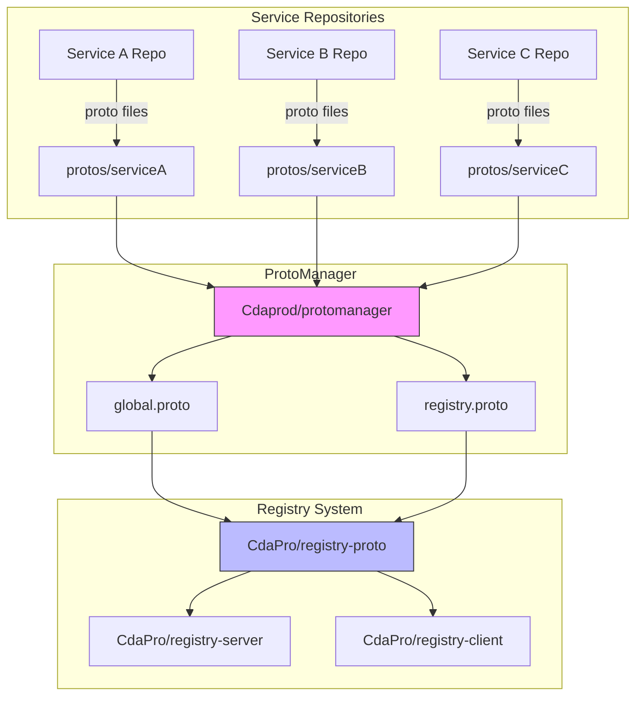
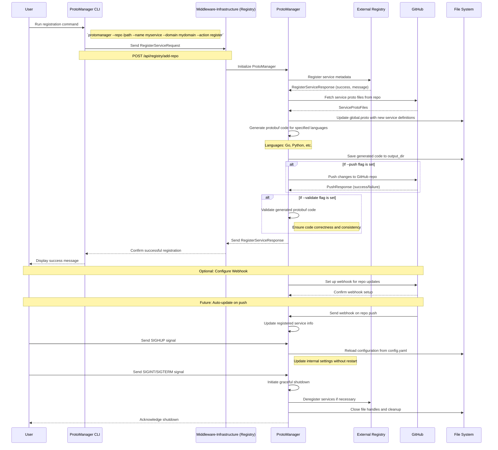
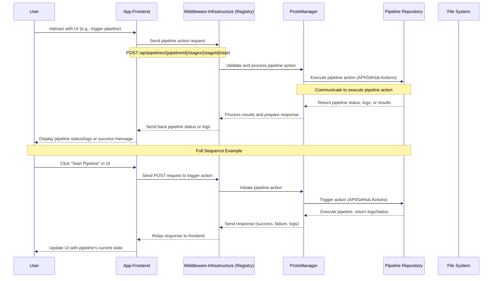

# ProtoManager

ProtoManager is a robust and scalable tool designed to manage Protocol Buffer (protobuf) workflows within microservices architectures. It automates the registration of microservices, manages global proto files, and ensures consistent generation of protobuf-based code across services. Leveraging Go's concurrency features and Viper for configuration management, ProtoManager provides a flexible and efficient solution for large-scale microservices management.

## Features

- **Dynamic Microservice Registration**: Easily register new microservices and manage their protobuf definitions.
- **Global Proto File Management**: Maintain a central proto file that aggregates all service definitions for consistency.
- **Automated Code Generation**: Automatically generate language-specific protobuf code whenever the global proto file is updated.
- **Configuration Management**: Use Viper for flexible and dynamic configuration handling.
- **Signal Handling**: Gracefully handle system signals for shutdowns and configuration reloads.
- **Event Subscription**: Subscribe to system events for real-time monitoring and logging.

#### Notes

•	No Direct Dependency: The protomanager package does not import or depend on any external Registry. It relies on the ProtoRegistry interface, ensuring loose coupling.
•	Event-Driven Architecture: The ProtoManager emits events that can be listened to by other components, facilitating communication without direct dependencies.
•	Modularity and Flexibility: The use of interfaces and dependency injection allows the protomanager to function independently or integrate with external systems as needed.
•	Generics and Concurrency: The ClusterManager and tasks utilize Go’s generics and concurrency features for efficient and type-safe task execution.

## Getting Started

### Prerequisites

- Go 1.20 or higher
- Git
- Protobuf Compiler (`protoc`)
- GitHub Actions (for CI workflows)

### Installation

1. **Clone the Repository**

   ```bash
   git clone https://github.com/Cdaprod/protomanager.git
   cd protomanager

2.	Install Dependencies

go mod tidy


3.	Setup Configuration

Create a config.yaml file in the root directory with the following content:

`global_proto_path: "./proto/global.proto"
microservice_proto_dir: "./proto/microservices"
output_dir: "./generated"`

Ensure that the proto directory contains a global.proto file that acts as the central repository of all microservice proto definitions.

### Usage

#### Building the CLI

```
cd Cdaprod/protomanager
go build -o protomanager .
```

#### Registering a Microservice

To register a new microservice and update the global proto file:

`go run cmd/main.go --repo /path/to/repo --name myservice --domain mydomain --action register --config ./config.yaml`

•	--repo: Path to the microservice repository.
•	--name: Name of the microservice.
•	--domain: Domain under which the microservice is registered.
•	--action: Action to perform (register, shutdown, etc.).
•	--config: Path to the configuration file.
	
#### Generating Protobuffs

./protomanager generate --packages git,docker --languages go,python --push --validate

#### Using External Registry

```go
// main.go

func main() {
    // Initialize logger
    logger := protomanager.NewLogger()

    // Initialize external registry
    extRegistry := registry.NewExternalRegistry()

    // Initialize ProtoManager with external ProtoRegistry
    pm, err := protomanager.NewProtoManager(extRegistry, "./proto/global.proto", "./proto/microservices", "./generated", logger)
    if err != nil {
        logger.Fatalf("Failed to initialize ProtoManager: %v", err)
    }

    // Rest of the code...
}
``` 

#### Handling Signals

The application listens for system signals such as SIGINT, SIGTERM, and SIGHUP to perform actions like shutdown and configuration reloads.

•	Shutdown: Send SIGINT or SIGTERM to gracefully shut down the application.
•	Reload Configuration: Send SIGHUP to reload the configuration file without restarting the application.

#### Testing

ProtoManager includes comprehensive tests to ensure functionality.

`go test ./pkg/protomanager/...`

#### CI/CD

ProtoManager uses GitHub Actions for continuous integration. The CI workflow is defined in .github/workflows/ci.yml.

#### Project Structure

``` 
CdaprodParentApp/
├── protomanager/
│   ├── cmd/
│   │   └── command.go
│   ├── cluster/
│   │   └── cluster.go
│   ├── tasks/
│   │   ├── protobuf_generation_task.go
│   │   ├── push_task.go
│   │   └── validation_task.go
│   ├── proto_registry.go
│   ├── internal_proto_registry.go
│   ├── protomanager.go
│   └── main.go
├── external/
│   └── registry/
│       └── registry.go
└── proto/
    └── global.proto
``` 

### Contributing

Contributions are welcome! Please follow these steps:

	1.	Fork the repository.
	2.	Create your feature branch (git checkout -b feature/NewFeature).
	3.	Commit your changes (git commit -m 'Add some feature').
	4.	Push to the branch (git push origin feature/NewFeature).
	5.	Open a Pull Request.

### License

This project is licensed under the MIT License - see the LICENSE file for details.

### Contact

For any inquiries or support, please contact Cdaprod.

---

## Diagrams 

ProtoManager is the central component for managing all the proto definitions across the system.​​​​​​​​​​​​​​​​

Let's structure the repositories to work with protomanager:

1. First, update `Cdaprod/protomanager` to handle registry system:
 
```yaml
# config.yaml for protomanager
system:
  name: "registry-system"
  version: "v1"
  output_dir: "./gen"

repositories:
  - name: "registry-proto"
    url: "github.com/CdaPro/registry-proto"
    proto_dir: "proto"
    dependencies: []
  
  - name: "registry-server"
    url: "github.com/CdaPro/registry-server"
    proto_dir: "proto"
    dependencies: ["registry-proto"]
  
  - name: "registry-client"
    url: "github.com/CdaPro/registry-client"
    proto_dir: "proto"
    dependencies: ["registry-proto"]

global_proto:
  output: "global.proto"
  package: "registry.system.v1"
  go_package: "github.com/CdaPro/registry-proto/gen/go"
```

2. Create base proto files in `CdaPro/registry-proto`:
 
```protobuf
// proto/registry.proto
syntax = "proto3";
package registry.v1;

import "google/protobuf/timestamp.proto";
import "global.proto";  // Will be generated by protomanager

service Registry {
    // Registration
    rpc RegisterService(RegisterServiceRequest) returns (RegisterServiceResponse);
    rpc UnregisterService(UnregisterServiceRequest) returns (UnregisterServiceResponse);
    
    // Discovery
    rpc GetService(GetServiceRequest) returns (GetServiceResponse);
    rpc ListServices(ListServicesRequest) returns (ListServicesResponse);
    
    // Health
    rpc ReportHealth(ReportHealthRequest) returns (ReportHealthResponse);
    
    // Stream updates
    rpc WatchServices(WatchServicesRequest) returns (stream WatchServicesResponse);
}

message Service {
    string id = 1;
    string name = 2;
    string version = 3;
    map<string, string> metadata = 4;
    ServiceStatus status = 5;
    google.protobuf.Timestamp created_at = 6;
    google.protobuf.Timestamp updated_at = 7;
}
```

3. Set up GitHub Actions in `protomanager` to auto-update registry system:
 
```yaml
name: Update Registry Protos

on:
  push:
    paths:
      - 'config.yaml'
      - 'proto/**'
  workflow_dispatch:

jobs:
  update-protos:
    runs-on: ubuntu-latest
    steps:
      - uses: actions/checkout@v3
      
      - name: Set up Go
        uses: actions/setup-go@v4
        with:
          go-version: '1.21'
      
      - name: Run protomanager
        run: |
          go run cmd/protomanager/main.go update --config config.yaml
      
      - name: Create Pull Request
        uses: peter-evans/create-pull-request@v5
        with:
          token: ${{ secrets.GITHUB_TOKEN }}
          commit-message: 'chore: Update generated proto files'
          title: 'chore: Update generated proto files'
          branch: update-protos
          base: main
```

4. Update `CdaPro/registry-server` to use protomanager's output:
 
```go
// internal/proto/loader.go
package proto

import (
    "context"
    pb "github.com/CdaPro/registry-proto/gen/go"
)

type ProtoLoader struct {
    protoDir string
    registry *Registry
}

func (l *ProtoLoader) LoadDefinitions(ctx context.Context) error {
    // Load and parse global.proto generated by protomanager
    return nil
}
```

5. Set up webhook handlers in registry-server:
 
```go
// internal/server/hooks.go
package server

import (
    "context"
    "net/http"
)

func (s *Server) handleProtoUpdate(w http.ResponseWriter, r *http.Request) {
    // Handle webhook from protomanager when protos are updated
    ctx := r.Context()
    
    if err := s.protoLoader.LoadDefinitions(ctx); err != nil {
        http.Error(w, err.Error(), http.StatusInternalServerError)
        return
    }
    
    w.WriteHeader(http.StatusOK)
}
```

6. Create development workflow:
 
```bash
# 1. Clone repositories
git clone https://github.com/Cdaprod/protomanager
git clone https://github.com/CdaPro/registry-proto
git clone https://github.com/CdaPro/registry-server
git clone https://github.com/CdaPro/registry-client

# 2. Set up protomanager
cd protomanager
go mod tidy
go run cmd/protomanager/main.go init

# 3. Add registry system to protomanager
cp config.yaml.example config.yaml
# Edit config.yaml to add registry system repos

# 4. Generate initial protos
go run cmd/protomanager/main.go update

# 5. Set up git hooks for auto-updates
cat > .git/hooks/pre-commit << 'EOF'
#!/bin/sh
go run cmd/protomanager/main.go validate
EOF
chmod +x .git/hooks/pre-commit
```




1. "Add Repo to Registry Sequence Diagram" - This diagram illustrates the process of adding a new microservice repository to the middleware registry using the ProtoManager CLI.

2. "Triggering Pipeline Actions Sequence Diagram" - This diagram shows the interaction flow when a user triggers a pipeline action from the frontend, and how it's processed through the system.

These diagrams effectively visualize the key processes in your system architecture, including:

- The role of ProtoManager within the Middleware-Infrastructure
- The interaction between various components (CLI, Middleware, External Registry, GitHub, File System)
- Conditional flows based on command flags (--push and --validate)
- Signal handling for configuration reloads and graceful shutdowns
- Webhook setup for future auto-updates
- The flow of pipeline actions from user interaction to execution and result display

These visualizations should provide a clear understanding of the system's workflow and the interactions between different components. 

#### Diagram 1



#### Diagram 2

